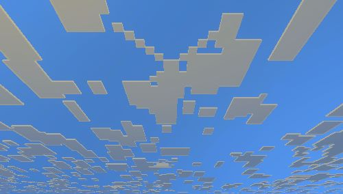
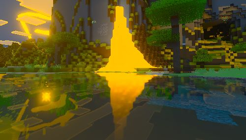

<!-- VEDA PBR PACK - Detailed README -->

# VEDA PBR PACK

**VEDA PBR Pack** — peningkatan visual berbasis PBR (Physically Based Rendering) untuk Minecraft.

Versi: **1.0.0**

Ringkasan singkat
- Menambahkan cubemaps, local lighting, dan banyak perbaikan PBR pada blok, entitas, dan item.
- Menyertakan penyesuaian color grading, fog, dan dukungan subsurface scattering (SSS) pada tekstur tertentu.

Fitur utama
- Cubemaps & improved reflections
- Local lighting dan SSS untuk material yang lebih realistis
- PBR textures untuk blok, entitas, dan item
- Penyesuaian atmosfer: fog, night coloring, ambient tweaks
- Berbagai optimasi kualitas (pilihan 16x / 256x / 512x)

Persyaratan
- Minecraft Bedrock edition (sesuaikan versi sesuai paket). Periksa kompatibilitas di deskripsi pack.
- Untuk beberapa fitur (mis. integrasi Raiden Visuals) mungkin memerlukan konfigurasi tambahan atau modifikasi game.

Instalasi
1. Ekstrak folder `VEDA PBR PACK` ke folder `resource_packs` pada perangkat Anda.
2. Aktifkan resource pack dari Settings → Global Resources (atau Resource Packs) di Minecraft.
3. Pilih subpack sesuai performa: `16x` (low), `256x` (medium/high), `512x` (recommended high quality).

Konfigurasi & Tips
- Gunakan subpack `16x` jika perangkat Anda terbatas memori/GPU.
- Jika Anda ingin hasil terbaik, gunakan `512x` dan aktifkan fitur grafis di pengaturan Minecraft.
- Untuk beberapa efek (SSS, volumetric fog), pastikan pengaturan grafis game dan driver GPU sudah up-to-date.

Screenshot (preview)
> Catatan: gambar diambil dari asset pack. Jika gambar tidak muncul di tampilan GitHub, periksa path `ui/` di repository.

Contoh perubahan (selengkapnya lihat CHANGELOG)
- Menambahkan PBR untuk banyak blok (concrete, copper variants, sculk, mushroom blocks, dll.)
- Perbaikan texture & PBR pada entitas dan item (mooshrooms, lanterns, swords, bucket_lava, dll.)

Troubleshooting
- Jika pack tidak muncul di game: pastikan struktur folder tidak berubah dan Anda menaruh `VEDA PBR PACK` langsung di `resource_packs`.
- Jika terjadi crash atau artefak grafis: coba subpack resolusi lebih rendah (16x) dan periksa log/game output.

Kontribusi
- Kalau Anda mau berkontribusi: fork repo, buat perubahan pada branch baru, lalu buka Pull Request. Sertakan preview screenshot untuk perubahan tekstur.

Lisensi & Kontak
- Author: VEDA_RAIDEN
- Discord: https://discord.gg/U2SUvJKQkk
- Untuk lisensi spesifik, periksa file LICENSE (jika ada) atau hubungi author lewat Discord.

Changelog
- Lihat `CHANGELOG.md` untuk daftar perubahan lengkap dan riwayat rilis.

Terima kasih telah menggunakan VEDA PBR Pack — selamat menikmati visual yang ditingkatkan!
---

# VEDA PBR PACK (Additional description)

VEDA PBR Pack — peningkatan visual PBR (Physically Based Rendering) untuk resource pack Minecraft.

Versi saat ini: 1.0.0

Ringkasan singkat:
- Menambahkan cubemaps, local lighting, dan banyak perbaikan PBR pada blok, entitas, dan item.
- Penyesuaian color grading, fog, dan subsurface scattering (SSS) pada beberapa tekstur.

Pemasangan:
1. Ekstrak folder `VEDA PBR PACK` ke folder `resource_packs` Minecraft.
2. Aktifkan resource pack di dalam game.

Dokumentasi dan changelog:
- Lihat `CHANGELOG.md` untuk daftar lengkap perubahan.
- Versi Inggris tersedia di `CHANGELOG_en.md`.

Kontak:
- Discord: https://discord.gg/U2SUvJKQkk
- Author: VEDA_RAIDEN

Terima kasih telah menggunakan VEDA PBR Pack!